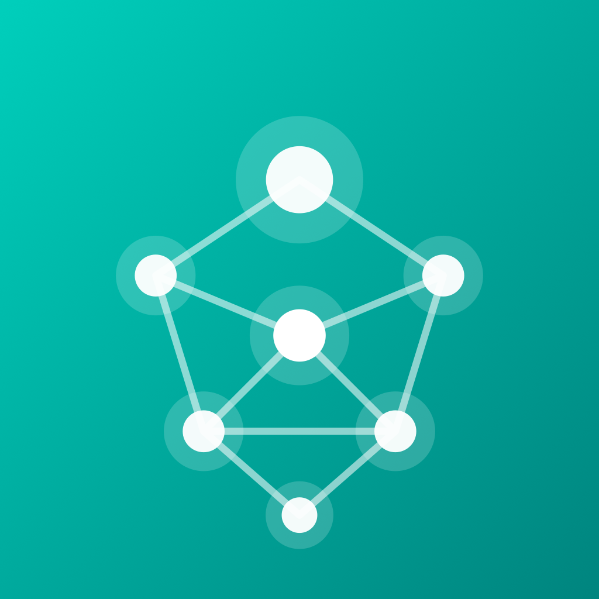
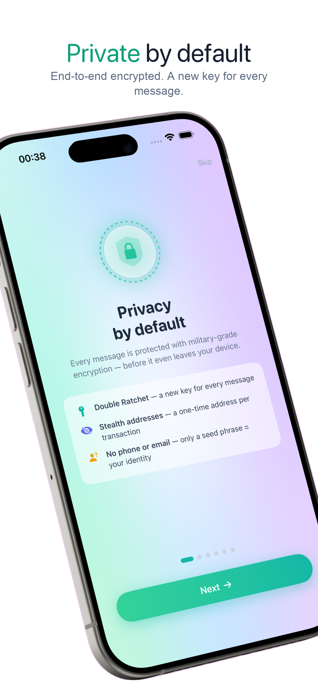
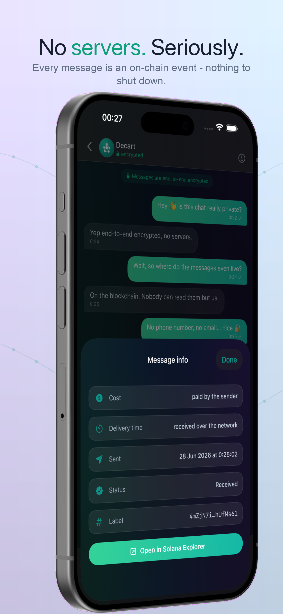
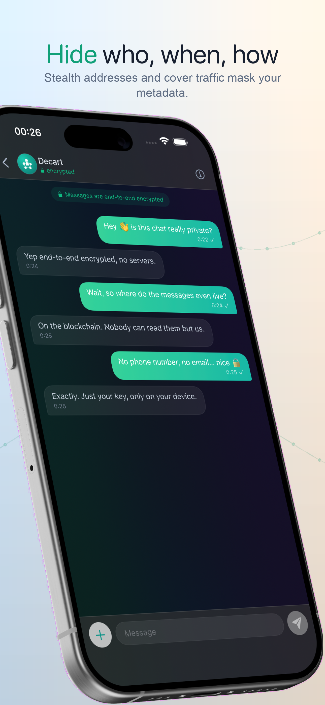
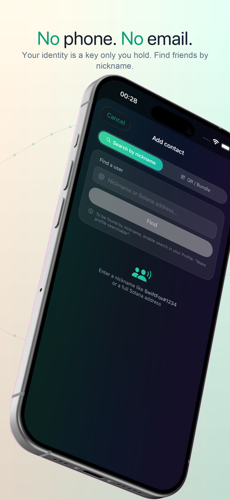
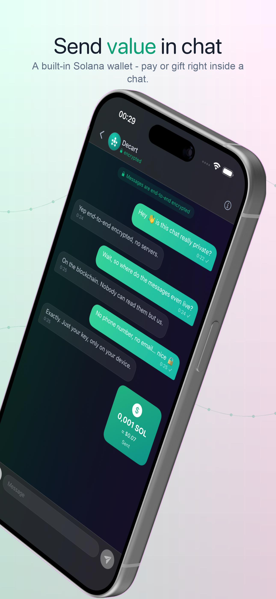
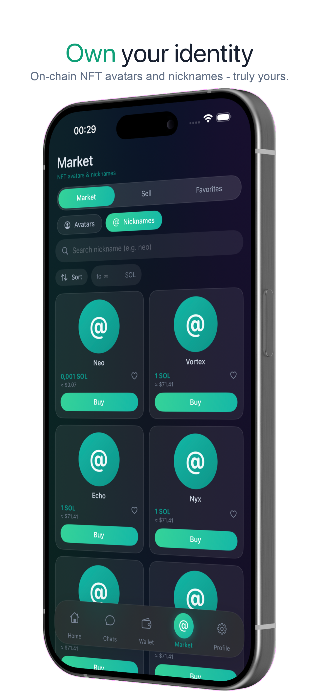

<div align="center">



# PrivaMesh

**A serverless, end-to-end encrypted messenger on Solana.**

*Trust math, not companies.*


**[privamesh.org](https://privamesh.org)**

</div>

---

PrivaMesh is a private messenger with **no backend of its own**. It speaks only to the public Solana blockchain. There is no PrivaMesh server, no message relay, no account database, no operator - so there is nothing to subpoena, breach, log, or shut down. Your messages live as encrypted blobs on a public ledger that nobody but the recipient can read; your keys never leave your device.

This is not "decentralized" as a slogan. The app literally has **one network dependency: a Solana RPC endpoint** (swappable, self-hostable). Below is exactly how that works.

## Screenshots

<div align="center">









</div>

## "No servers" - concretely

Every piece of *shared* state is a verifiable on-chain object. Everything private is local to the device. Nothing else exists.

| What | Where it lives | How |
|------|----------------|-----|
| A message | Solana transaction (memo) | encrypted envelope inside an SPL **Memo** instruction |
| Your inbox | the blockchain | `getSignaturesForAddress` on your one-time addresses |
| Discovery (find by nickname) | a registry address | a **wallet-signed** prekey bundle posted as a memo |
| Identity / contacts / chat history | **your device only** | SwiftData + Keychain, never transmitted |
| Private keys & seed | **your device only** | iOS Keychain, device-only, biometric-lockable |

There is no API to call, no server to trust. Any client can independently verify every shared event by reading the chain.

### Message lifecycle

1. **Send** - the client encrypts the message, wraps it in a memo, and submits one Solana transaction. The transfer carries **0 lamports** (value-less) - the memo is the payload.
2. **Transport** - the transaction lands on-chain. The memo is the ciphertext; the chain is the "queue".
3. **Receive** - the recipient polls `getSignaturesForAddress` on the expected one-time address, pulls the memo, and decrypts it locally. No push server, no relay.

## Encryption

The cryptographic core is a well-established design: **X3DH** for the asynchronous handshake, the **Double Ratchet** for ongoing messages.

- **Key agreement** - X3DH over Curve25519. The first message is self-contained (carries the sender's identity + ephemeral keys), so a recipient can decrypt a first message from a stranger without any prior server-stored state.
- **Per-message keys** - Double Ratchet: `KDF_RK = HKDF-SHA256`, `KDF_CK = HMAC-SHA256`, payload sealed with `AES-256-GCM` (the 40-byte ratchet header is bound as Associated Data). A fresh key per message → **forward secrecy** and post-compromise security.
- **Padding** - plaintext is padded to fixed buckets before encryption, so ciphertext length doesn't leak message length.

> Code: [`Core/PrekeyBundle.swift`](privamesh/Core/PrekeyBundle.swift) (X3DH), [`Core/DoubleRatchet.swift`](privamesh/Core/DoubleRatchet.swift), [`Core/CryptoBox.swift`](privamesh/Core/CryptoBox.swift).

## Anonymity & metadata privacy

End-to-end encryption hides *content*. A public ledger still exposes *metadata* - so PrivaMesh adds independent layers to hide **who**, **when**, and **how**.

### Stealth addresses - hide the social graph

If every message to a contact hit the same inbox address, the chain would reveal your entire conversation graph. Instead, each conversation derives a **one-time address per message** from the X3DH shared secret (`StealthAddress.address(root, label, index)`). Both parties can compute the next address; an outside observer sees unrelated single-use addresses with no visible link to either participant.

### Cover traffic - hide timing

*When* you talk is metadata. With cover traffic on, the client emits decoy messages (`kind = cover`) at randomized intervals - full, valid encrypted messages that advance the ratchet and are silently dropped on receipt. On-chain they are indistinguishable from real traffic, breaking timing correlation. Opt-in (costs fees).

### Gas wallet - hide the payer

A transaction's fee payer is public. By default your main wallet pays, linking it to your activity. PrivaMesh lets a **separate, throwaway gas wallet** pay message fees - funded from an unlinkable source - so on-chain your messages trace to a disposable payer, not your identity. The client is its own relayer.

### Unlinkable accounts

Messaging keys are generated per account and stored device-only; multiple accounts on one device are cryptographically unlinkable (and, with per-account gas wallets, unlinkable on-chain too).

## Anti-MITM discovery

Finding someone by nickname uses an **on-chain registry** instead of a key server. The published prekey bundle is **wallet-signed**: an ed25519 signature ties the messaging keys to the Solana address that posted them. A client verifies the signature before trusting any discovered bundle, so nobody can inject a forged identity for a nickname they don't control. A trusted key server is replaced by a publicly auditable, self-authenticating record.

> Code: [`Core/OnChainDiscovery.swift`](privamesh/Core/OnChainDiscovery.swift), [`Core/PollingService.swift`](privamesh/Core/PollingService.swift).

## Security model

**What an adversary cannot do.** Without your device keys, no party - including any RPC operator - can read message content, forge a discovered identity (signatures are verified), or seize funds. There is no central store to breach.

**What remains visible.** The blockchain is public. Transaction existence, timing (mitigated by cover traffic), and fee payers (mitigated by the gas wallet) are observable to a global passive adversary. Stealth addresses unlink the recipient graph but don't hide that *some* transaction occurred. Anonymity therefore depends on using the privacy layers and on how the funding wallets were sourced.

**Forward secrecy vs. recoverability.** Messaging keys and ratchet sessions are random and device-local. This delivers forward secrecy and deniability - and means restoring an account from its seed recovers funds, **not** message history. The on-chain ciphertext stays, but is undecryptable without the original ratchet state. A deliberate trade-off, matching comparable secure messengers.

Full design + threat analysis: **[White Paper](WHITEPAPER.md)**.

## Tech

- **SwiftUI** + SwiftData, iOS 17+
- **CryptoKit** - Curve25519 X3DH, HKDF/HMAC-SHA256, AES-256-GCM; TweetNacl for ed25519 wallet signatures
- **SolanaSwift** - SPL Memo / Token / System programs, raw JSON-RPC
- iOS **Keychain** (device-only, biometric-lockable) for seed + messaging keys

```bash
open privamesh.xcodeproj   # scheme: privamesh → run on device/simulator
```

Configuration: `Core/SolanaRPCService.swift` ships a `YOUR_HELIUS_API_KEY` placeholder and falls back to public Solana RPC; users can set a custom RPC in-app. Use a read-only RPC key only - never commit private keys.

> Each account is a self-custodial Solana keypair, so the app also includes a lightweight SOL wallet and on-chain NFT avatars/nicknames. These are secondary to messaging and documented in the white paper.

---

<div align="center">
<sub>Runs on Solana mainnet-beta. Network actions cost real SOL fees. Describes the system as implemented; not investment advice.</sub>
</div>
